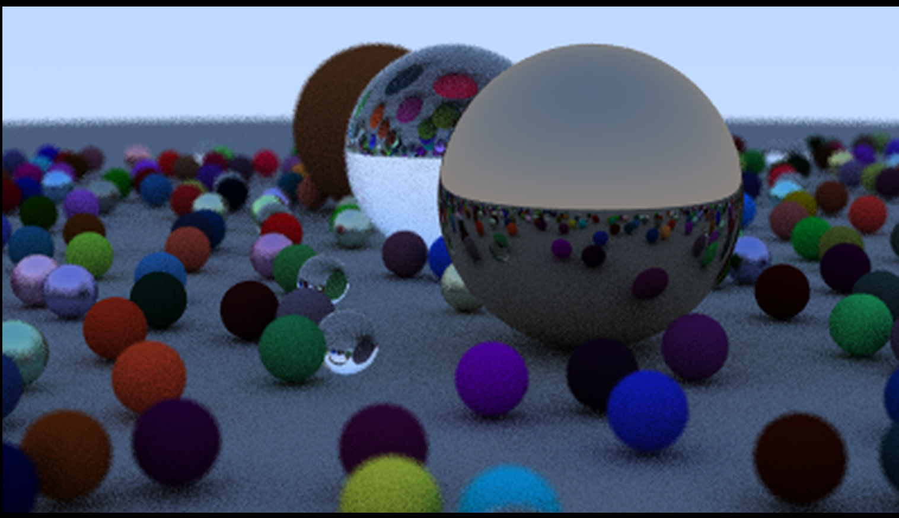
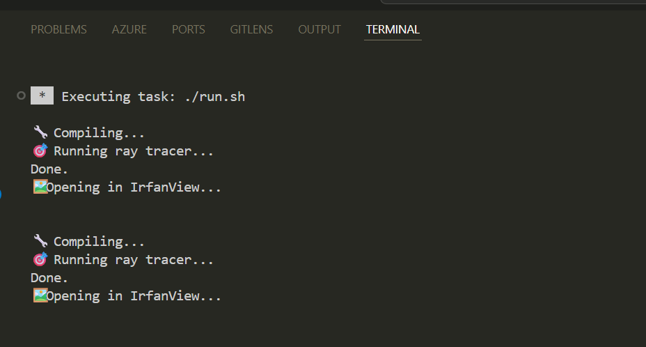
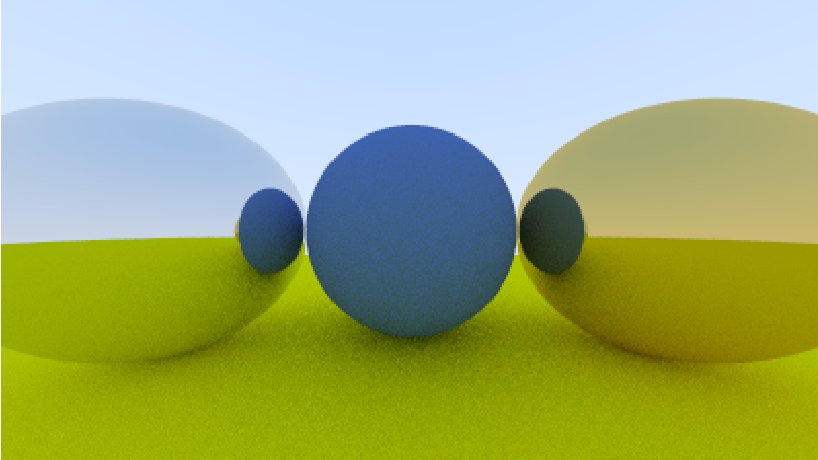
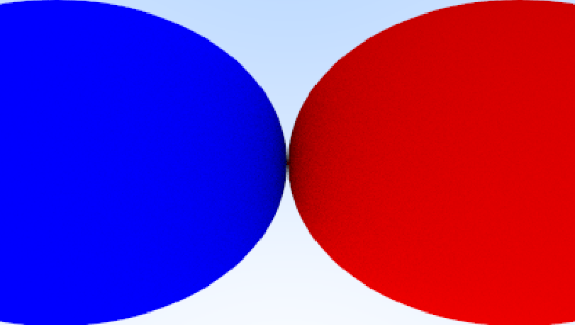
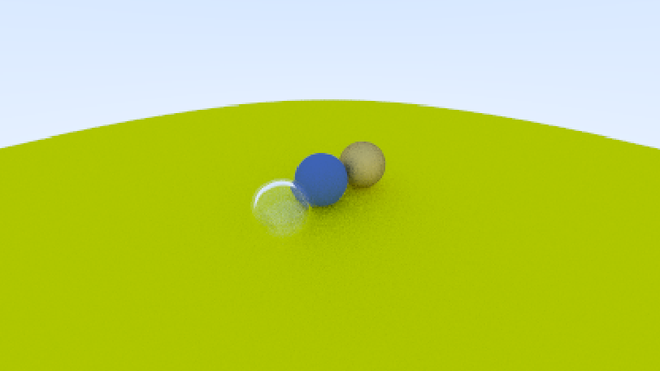

# 🌌 RayCraft — A C++ Ray Tracer



**RayCraft** is a physically based ray tracer built entirely from scratch in C++ by following _Peter Shirley’s_ legendary **“Ray Tracing in One Weekend”** series.  
It demonstrates the beauty of computer graphics by simulating light transport with recursive ray tracing and materials that scatter, reflect, and refract light realistically.

---

## 🚀 Features

- Custom vector and ray math library (`vec3.h`, `ray.h`)
- Modular scene construction via `hittable` and `hittable_list`
- Realistic materials:
  - Diffuse (Lambertian)
  - Metallic (Reflective)
  - Dielectric (Transparent / Glass)
- Defocus blur (depth of field)
- Gamma correction for tone mapping
- Multi-sample anti-aliasing
- Recursive ray color computation
- Outputs `.ppm` format image that can be converted to `.png`

---

## 🧠 Ray Tracing Concept

Ray tracing works by tracing light backward — from the **camera** through each **pixel** into the **scene**.  
Each ray either hits an object (where material physics are simulated) or returns a background color.

Mathematically:

```cpp
Color = (1.0 - t) * sky_color + t * object_color;
```

where `t` controls how far the ray travels, producing smooth color gradients and realistic shading.

---

---

## ⚙️ Build & Run Instructions

### 🧩 Prerequisites

- C++17 or later
- Any standard compiler:

  - **Windows:** MinGW / MSVC
  - **Linux / macOS:** `g++` or `clang++`

### 🧱 Clone the Repository

```bash
git clone https://github.com/sahilmadaan048/RayCraft.git
cd RayCraft
```

---

### ▶️ Run Using Bash Script (Windows Compatible)

You can use the following bash script to compile and run the ray tracer easily (works with Git Bash or WSL):

```bash
#!/bin/bash

echo "🔧 Compiling..."
g++ main.cpp -o main || exit 1

echo "🎯 Running ray tracer..."
./main > output.ppm || exit 1

echo "🖼️ Opening in IrfanView..."
"/c/Program Files/IrfanView/i_view64.exe" output.ppm
```

To run:

```bash
bash run.sh
```

> 💡 Make sure you have [**IrfanView**](https://www.irfanview.com/) installed at
> `C:\Program Files\IrfanView\i_view64.exe`.
> Otherwise, you can open the output manually using any `.ppm` viewer.

---

### 🧱 Manual Build (Alternative)

```bash
g++ -std=c++17 -O2 main.cpp -o raycraft
./raycraft > image.ppm
```

You can then convert the `.ppm` file to `.png` using **ImageMagick**:

```bash
magick image.ppm images/image.png
```

## 🖼️ Sample Output

Here’s the final rendered image from RayCraft:









---

## 🔍 Key Implementation Highlights

### 📘 Diffuse Material (Lambertian)

```cpp
bool scatter(const ray& r_in, const hit_record& rec, color& attenuation, ray& scattered) const override {
    vec3 scatter_direction = rec.normal + random_unit_vector();
    scattered = ray(rec.p, scatter_direction);
    attenuation = albedo;
    return true;
}
```

### 🔮 Metallic Reflection

```cpp
vec3 reflected = reflect(unit_vector(r_in.direction()), rec.normal);
scattered = ray(rec.p, reflected + fuzz * random_in_unit_sphere());
```

### 💎 Dielectric (Refraction / Glass)

```cpp
double refraction_ratio = rec.front_face ? (1.0 / ir) : ir;
vec3 direction = refract(unit_direction, rec.normal, refraction_ratio);
scattered = ray(rec.p, direction);
```

---

## 📚 References

- 📖 _Ray Tracing in One Weekend_ by **Peter Shirley**
- 🌐 [https://raytracing.github.io/books/RayTracingInOneWeekend.html](https://raytracing.github.io/books/RayTracingInOneWeekend.html)

---

## 👨‍💻 Learner / Author

**Sahil Madaan** [GitHub](https://github.com/sahilmadaan048)

**NIT Srinagar**

---

⭐ **If you enjoyed this project, give it a star to support!**
